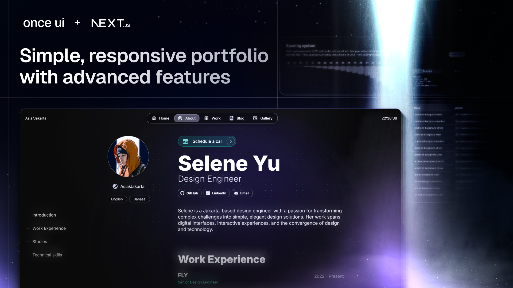

# Adnan Ahmad - Portfolio Website

A modern, responsive portfolio website showcasing my work as a Frontend Software Engineer. Built with Next.js, React, and TypeScript.



## About

This is my personal portfolio website where I showcase my projects, blog posts, and professional experience. The site features a clean, minimalist design optimized for performance and accessibility.

## Tech Stack

- **Framework**: Next.js 14 (App Router)
- **UI Library**: React 18
- **Language**: TypeScript
- **Styling**: SCSS Modules, Tailwind CSS
- **Content**: MDX for blog posts and project descriptions
- **Deployment**: Vercel-ready

## Features

- **Responsive Design**: Optimized for all screen sizes and devices
- **SEO Optimized**: Automatic metadata, Open Graph, and sitemap generation
- **Blog System**: MDX-based blog with syntax highlighting
- **Project Showcase**: Detailed project pages with images and descriptions
- **About Page**: Professional background, work experience, and technical skills
- **Gallery**: Visual showcase of work samples
- **Newsletter Integration**: Mailchimp subscription functionality
- **Password Protection**: Route guards for protected content
- **Performance**: Server-side rendering and optimized images

## Getting Started

### Prerequisites

- Node.js v18.17 or higher
- npm or yarn package manager

### Installation

1. **Clone the repository**
   ```bash
   git clone <your-repo-url>
   cd adnan-ahmad
   ```

2. **Install dependencies**
   ```bash
   npm install
   ```

3. **Run the development server**
   ```bash
   npm run dev
   ```

4. **Open your browser**
   Navigate to [http://localhost:3000](http://localhost:3000)

### Configuration

Edit the configuration files to customize the portfolio:

- **Personal Information**: `src/app/resources/content.js`
- **Site Configuration**: `src/app/resources/config.js`

### Adding Content

- **Blog Posts**: Add `.mdx` files to `src/app/blog/posts/`
- **Projects**: Add `.mdx` files to `src/app/work/projects/`
- **Images**: Place images in `public/images/`

## Project Structure

```
├── src/
│   ├── app/              # Next.js app router pages
│   │   ├── about/        # About page
│   │   ├── blog/         # Blog listing and posts
│   │   ├── work/         # Projects listing and details
│   │   └── resources/    # Configuration and content
│   ├── components/       # React components
│   └── once-ui/         # UI component library
├── public/              # Static assets
└── package.json
```

## Available Scripts

- `npm run dev` - Start development server
- `npm run build` - Build for production
- `npm run start` - Start production server
- `npm run lint` - Run ESLint

## Deployment

The easiest way to deploy is using [Vercel](https://vercel.com):

1. Push your code to GitHub
2. Import your repository on Vercel
3. Deploy with one click

The site is optimized for Vercel's platform with automatic deployments on every push.

## Contact

- **Email**: cyberlyadnan@gmail.com
- **LinkedIn**: [adnanahmad9334](https://www.linkedin.com/in/adnanahmad9334/)
- **GitHub**: [cyberlyadnan](https://github.com/cyberlyadnan)
- **X (Twitter)**: [@adnanahmad9334](https://x.com/adnanahmad9334)

## License

This project is open source and available under the [MIT License](LICENSE).

---

Built with ❤️ by Adnan Ahmad
